## <font size = 5> **HW1 Report** </font>
<p align="right"> 108062119 鄭幃謙 </p>

---
### <font size=4> **1. Color Quantization and Dithering** </font>

**a. Perform the median-cut color quantization to transform the given 24-bit color image (Lena image) to an n-bit color image.**<br>

`medianCut()`
```python
# flatten the image
flattenImage = []
for rowIndex, rows in enumerate(image):
    for colIndex, pixel in enumerate(rows):
        flattenImage.append([rowIndex, colIndex, pixel[0], pixel[1], pixel[2]])
flattenImage = np.array(flattenImage)
# run recursion
solve(image, flattenImage, n)
```
`solve()`
```python
# end of recursion
if depth == 0:
    bAverage = np.mean(flattenImage[:,2])
    gAverage = np.mean(flattenImage[:,3])
    rAverage = np.mean(flattenImage[:,4])
    for pixel in flattenImage:
        image[pixel[0]][pixel[1]] = [bAverage, gAverage, rAverage]
    return
# calculate BGR ranges
bRange = np.max(flattenImage[:,2]) - np.min(flattenImage[:,2])
gRange = np.max(flattenImage[:,3]) - np.min(flattenImage[:,3])
rRange = np.max(flattenImage[:,4]) - np.min(flattenImage[:,4])
# sort with the max range
maxRange = np.argmax([-1, -1, bRange, gRange, rRange])
flattenImage = flattenImage[flattenImage[:, maxRange].argsort()]
medianIndex = int((len(flattenImage) + 1) / 2)
# next depth
solve(image, flattenImage[0:medianIndex], depth - 1)
solve(image, flattenImage[medianIndex:], depth - 1)
```
首先是利用median-cut algorithm，在遞迴中每步將bucket中所有pixel根據R, G, B值中range最大的sort，並分成兩個bucket下去遞迴，在遞迴的終點將所有pixel的值改為這個bucket中的平均值。如此一來因為遞迴n個深度，最後分成2^n個bucket，得到2^n種顏色。<br>

**a. You need to find the index colors and construct the Look-Up-Table for the bit-reduced color quantization.**<br>

``` python
# build look-up table
lookUpTable3 = utils.constructTable(image3)
lookUpTable6 = utils.constructTable(image6)
# bit reduce
image3_reduce = utils.bitReduce(image3, lookUpTable3)
image6_reduce = utils.bitReduce(image6, lookUpTable6)
```
`constructTable()`
``` python
colorMap = set([tuple(j) for i in image for j in i])
table = {}
code = 0
for color in colorMap:
    table[color] = code
    table[code] = color
    code += 1
return table
```
`bitReduce()`
``` python
newImage = np.zeros(shape=(image.shape[0], image.shape[1]), dtype='uint8')
for i in range(image.shape[0]):
    for j in range(image.shape[1]):
        newImage[i][j] = table[tuple(image[i][j])]
return newImage
```
建造一個dictionary用以存圖片中的2^n個顏色及編碼後的數字，如n=3時編碼會是0-7，就可以用3個bit來表示。<br>

**a. Show the color-quantized image and compute the color quantization MSE error. Perform the above operation for n=3 and 6 and discuss the results.**<br>

<center>
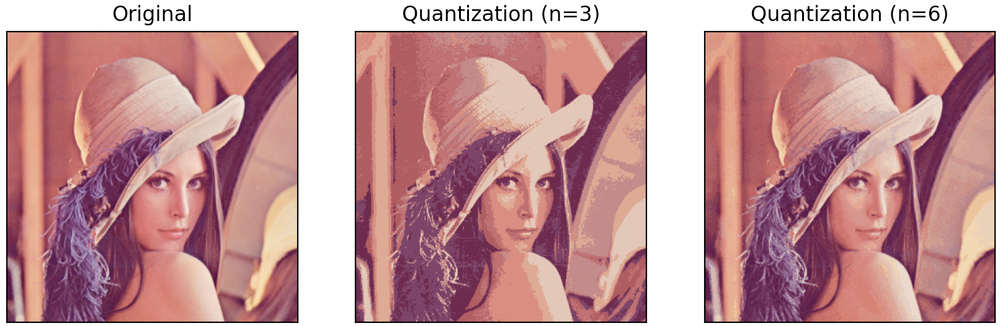
</center>
<center>
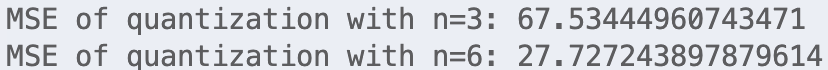
</center>
只用8種顏色的效果不是太好。雖然用64種顏色就可以達到遠看幾乎跟原圖一樣，但細看還是會發現有許多不同顏色的交界處十分明顯。<br>

**b. With the above color quantization (n=3 and 6), apply the diffusion dithering technique to transform the original image to the bit-reduced color image.**<br>

``` python
# define height and width for the image
h, w = image.shape[:2]
# tranform to float
image = np.array(image, dtype=float)
# dither every pixels
for rowIndex in range(h):
    for colIndex in range(w):
        # find new color with shortest distance
        oldColor = image[rowIndex][colIndex].copy()
        newColor = findClosestColor(image[rowIndex][colIndex], colorMap)
        # calculate error
        image[rowIndex][colIndex] = newColor
        error = oldColor - newColor
        # apply error
        if colIndex + 1 < w:
            addError(image[rowIndex][colIndex + 1], (7 / 16) * error)
        if rowIndex + 1 < h:
            addError(image[rowIndex + 1][colIndex], (5 / 16) * error)
            if colIndex - 1 >= 0:
                addError(image[rowIndex + 1][colIndex - 1], (3 / 16) * error)
            if colIndex + 1 < w:
                addError(image[rowIndex + 1][colIndex + 1], (1 / 16) * error)
# tranform back
image = np.array(image, dtype='uint8')
```
`findClosestColor()`
``` python
closestColor = pixel
minDistance = np.inf
for color in colorMap:
    newDistance = calDistance(np.array(pixel), np.array(color))
    if newDistance < minDistance:
        minDistance = newDistance
        closestColor = color
return closestColor
```
<br><br><br>
`addError()`
``` python
for i in range(3):
    # clamp to 0-255
    pixel[i] = max(0, min(pixel[i] + error[i], 255))
```
這裡我是照著維基百科查到的演算法，對圖片中的每個pixel做：<br>
1. 從a部分找出的2^n個顏色中找到與這個pixel顏色最近(Euclidean distance)的顏色。
2. 計算原顏色跟新顏色的差異，稱為error。
3. 根據mask的值將error diffuse到附近的pixel。
4. 以新的顏色取代目前的pixel。<br>

其中`addError()`的用意是將pixel的value限制在0-255。而bit reduce的部分與a部分相同不再多提。<br>

**b. Show the dithered color image and compute the color quantization MSE error. Discuss the effect of the dithering technique.**<br>

<center>
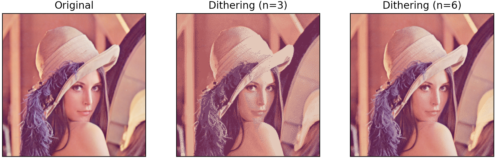
</center>
<center>
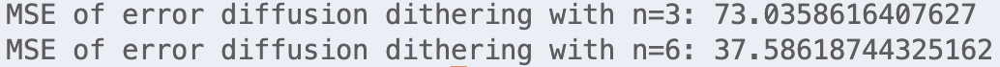
</center>
可以看到雖然MSE相較a部分稍大，但圖片看起來幾乎是和原圖一模一樣，也不再有明顯的色塊相接處，而是變為自然的漸層效果。<br><br><br><br><br><br><br><br><br><br><br><br><br><br>


### <font size=4> **2. Interpolation** </font>

**a. Nearest-neighbor (NN) interpolation.**<br>

``` python
# define height and width for the image
h, w = image.shape[:2]
# initialize new image
image_NN = np.zeros(shape = (4 * h, 4 * w, 3), dtype='uint8')
# calculate each pixel in new image
for i in range(4 * h):
    for j in range(4 * w):
        image_NN[i][j] = image[int(i / 4)][int(j / 4)]
```
這部分比較簡單，就是將新圖中的index除以4並取整直接將圖片長寬各放大四倍。<br>

**b. Bilinear interpolation.**<br>

``` python
# define height and width for the image
h, w = image.shape[:2]
# initialize new image
image_BL = np.zeros(shape=(4 * h, 4 * h, 3))
# calculate each pixel in new image
for i in range(4 * h):
    for j in range(4 * w):
        # find position in original image
        x = (i + 1) / 4 - 1
        y = (j + 1) / 4 - 1
        # find referencing point
        xIndex = int(x)
        yIndex = int(y)
        # calculate differnce
        u = x - xIndex
        v = y - yIndex
        # # calculate by value * area
        image_BL[i][j] += (1 - u) * (1 - v) * image[xIndex][yIndex]
        if xIndex + 1 < h:
            image_BL[i][j] += u * (1 - v) * image[xIndex + 1][yIndex]
        if yIndex + 1 < w:
            image_BL[i][j] += (1 - u) * v * image[xIndex][yIndex + 1]
            if xIndex + 1 < h:
                image_BL[i][j] += u * v * image[xIndex + 1][yIndex + 1]
        # fix value
        for c in range(3):
            if image_BL[i][j][c] < 0:
                image_BL[i][j][c] = 0
```
這裡我是按照講義上的方法(如下圖)，先計算出在原圖片中的位置並找到參考點，然後根據與參考點之間對應的面積計算新的值。最後確保值不會小於0。<br>
<center>
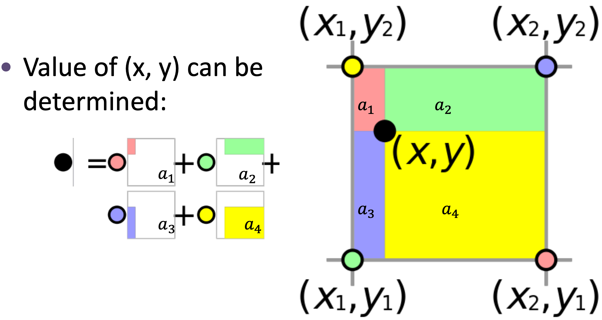
</center>

**c. Compare results from (a) & (b). Discuss what you observe.**<br>

<center>
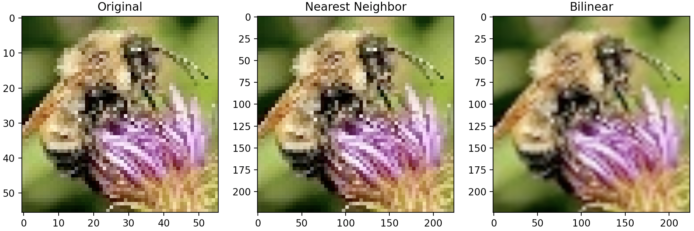
</center>
可以看出用a的方法基本上就跟原圖一模一樣，只是把他等比例放大。但b的方法就確實讓圖片有更多細節。下圖是我用bilinear把它長寬各放大100倍，其實不會再更清楚了。<br>
<center>
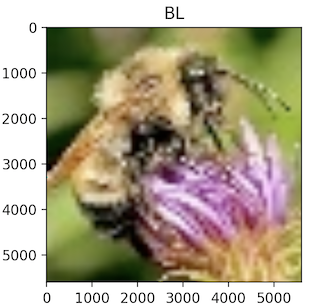
</center> <br><br>

### <font size=4> **3. Photo enhancement** </font>

**a. Convert the RGB color space to YIQ, and show the image histogram of Y channel.**<br>

`RGB2YIQ()`
``` python
# define height and width for the image
h, w = image.shape[:2]
# initialize new image
image_YIQ = np.zeros(shape=(h, w, 3), dtype='float64')
# calculate each channel
for i in range(h):
    for j in range(w):
        image_YIQ[i][j][0] += 0.299 * image[i][j][0] + 0.587 * image[i][j][1] + 0.114 * image[i][j][2]
        image_YIQ[i][j][1] += 0.596 * image[i][j][0] - 0.275 * image[i][j][1] - 0.321 * image[i][j][2]
        image_YIQ[i][j][2] += 0.212 * image[i][j][0] - 0.523 * image[i][j][1] + 0.311 * image[i][j][2]
```
透過下圖的方法將RGB轉換成YIQ。<br>
<center>
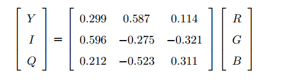
</center>
從histogram可以看出y值都偏高所以整張圖看起來白白的。<br>
<center>
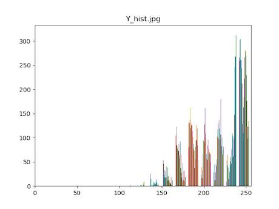
</center>

**b. Apply gamma transform to Y channel with a suitable gamma value.**<br>

``` python
# standarize to 0-1
    image_YIQ[:,:,0] /= 255.0
    # gamma tranformation
    image_YIQ[:,:,0] = np.power(image_YIQ[:,:,0], gamma)
    # de-standarize
    image_YIQ[:,:,0] *= 255
```
要先將圖片標準化到0-1，再做power(gamma)，最後再回到0-255。下圖是我試了幾個不同的gamma，我認為gamma = 3的效果最合適。<br>
<center>
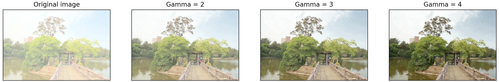
</center>

**c. Convert the transformed image from YIQ color space back to RGB to show the result with the best gamma value. Also show the histogram of Y channel for the transformed image**<br>

``` python
# define height and width for the image
h, w = image.shape[:2]
# initialize new image
image_RGB = np.zeros(shape=(h, w, 3), dtype='float64')
# calculate each channel
for i in range(h):
    for j in range(w):
        image_RGB[i][j][0] += image[i][j][0] + 0.956 * image[i][j][1] + 0.621 * image[i][j][2]
        image_RGB[i][j][1] += image[i][j][0] - 0.272 * image[i][j][1] - 0.647 * image[i][j][2]
        image_RGB[i][j][2] += image[i][j][0] - 1.106 * image[i][j][1] + 1.703 * image[i][j][2]
```
跟前面的方法類似，改為乘以反矩陣。<br>
從histogram可以看出y值分佈的較為平均。<br>
<center>
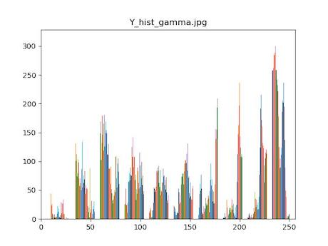
</center>

**d. Compare the image and histogram before and after your enhancement. Discuss what you observed.**<br>

<center>
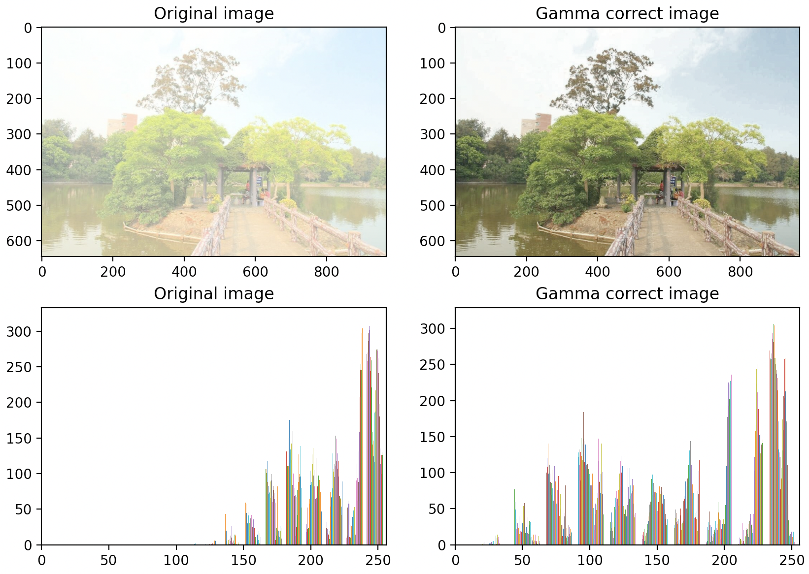
</center>
可以發現y值分佈的更平均後圖片就不會一片白白的了。
