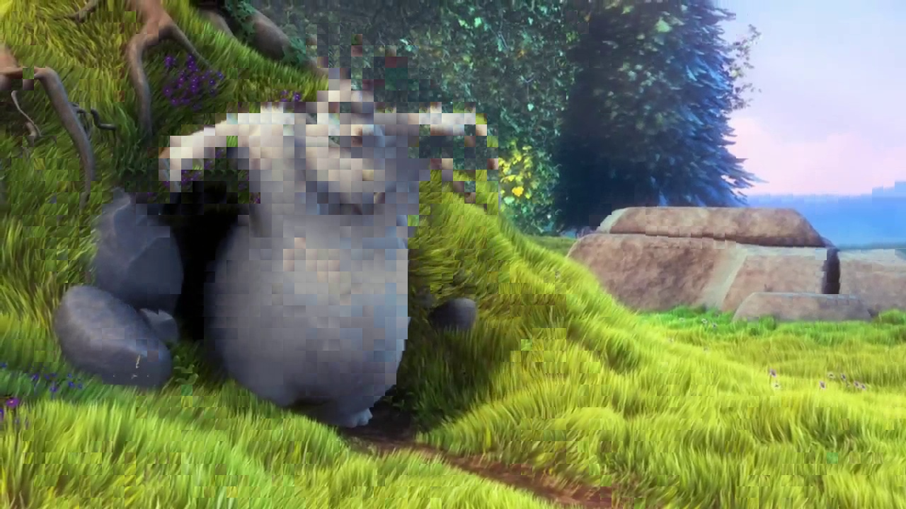
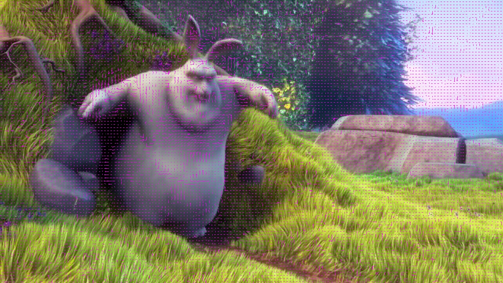

## <font size = 5> **HW3 Report** </font>
<p align="right"> 108062119 鄭幃謙 </p>

---
### <font size=4> **1. Try the two search ranges for two macroblock sizes by using the two search methods. The reference image is 40.jpg, and the target image is 42.jpg.** </font>

**Implementation**<br>

`def fullSearch(tar, ref, row, col, searchRange):`
``` python
best = None
minSAD = np.inf
for i in range(-searchRange, searchRange + 1):
    for j in range(-searchRange, searchRange + 1):
        if 0 <= row + i < ref.shape[0] and 0 <= col + j < ref.shape[1]:
            nowSAD = calSAD(ref[row + i, col + j], tar[row, col])
            if nowSAD < minSAD:
                minSAD = nowSAD
                best = (i, j)
return np.array(best)
```
full search的做法較單純，在search range內的blocks中找到SAD最小的作為結果。<br>

`def logSearch(tar, ref, row, col, searchRange):`
``` python
best = None
minSAD = np.inf
step = searchRange // 2
center = (0, 0)
while step >= 1:
    for i in [-step, 0, step]:
        for j in [-step, 0, step]:
            if i * j != 0 and (i != 0 or j != 0):
                continue
            if 0 <= row + center[0] + i < ref.shape[0] and 0 <= col + center[1] + j < ref.shape[1]:
                nowSAD = calSAD(ref[row + center[0] + i, col + center[1] + j], tar[row, col])
                if nowSAD < minSAD:
                    minSAD = nowSAD
                    best = (i, j)
    center = updateCenter(center, best, row, col, ref.shape)
    best = (0, 0)
    step //= 2
for i in [-1, 0, 1]:
    for j in [-1, 0, 1]:
        if 0 <= row + center[0] + i < ref.shape[0] and 0 <= col + center[1] + j < ref.shape[1]:
            nowSAD = calSAD(ref[row + center[0] + i, col + center[1] + j], tar[row, col])
            if nowSAD < minSAD:
                minSAD = nowSAD
                best = (i, j)
center = updateCenter(center, best, row, col, ref.shape)
return np.array(center)
```

2d-logarithmic search的做法差別在於移動的center，每一輪中只檢查上下中左右五個blocks，找到最相近的更新center並縮小搜尋範圍後繼續。最後再從最近的9個block中找出最終結果。<br>

**Result**<br>

1. full r8b8 / r16b8 / r8b16 / r16b16<br>
<center>


</center>
<center>


</center>
<center>


</center>
基本上full search的效果都滿好的，range大小的影響不太明顯，但是blocksize較大會使得圖片有移動處有更明顯的方塊感。<br>

2. 2d-log r8b8 / r16b8 / r8b16 / r16b16<br>
<center>



</center>
<center>




</center>
<center>


</center>
2d-logarithmic search的計算速度比full search快非常多，不過結果明顯看得出較差。在range較小時常常找不到最佳匹配塊，比較細節的地方（如兔子耳朵）會因為搜尋機制的關係找到差很多的方塊。在blocksize較大的結果就更差了。<br>

**SAD and PSNR values**<br>
<br>
可以看出full search整體比2d-logarithmic search更好，而blocksize越小越好，search range越大越好。<br>

### <font size=4> **2. Try the full search method with search range p=8 and macroblock sizes = 8x8. The reference image is 40.jpg, and the target image is 51.jpg.** </font>

**Result**<br>
<center>


</center>
因為移動的範圍過大而搜尋範圍過小無法找到匹配塊，雖然圖形輪廓上大致能看出來但細節失真很嚴重。

**PSNR value**<br>
`SAD: 19796761, PSNR: 31.6623`<br>
與full_r8_b8相比，其實只略差一些。可見full search效果很好。

### <font size=4> **3. Analyze the time complexity.** </font>

**Time complexity**<br>
full search的time complexity應為 O(p<sup>2</sup>)，而2d-logarithmic search的time complexity應為 O(log(p))，p為search range。<br>

**Execution time**<br>
<br>
基本上算是符合預期，full search的部分range變為2倍時runtime約變為4倍。2d-logarithmic search的部分range從8變為16時runtime約變為1.3倍 ~= log<sub>2</sub><sup>16</sup> / log<sub>2</sub><sup>8</sup> = 4 / 3。